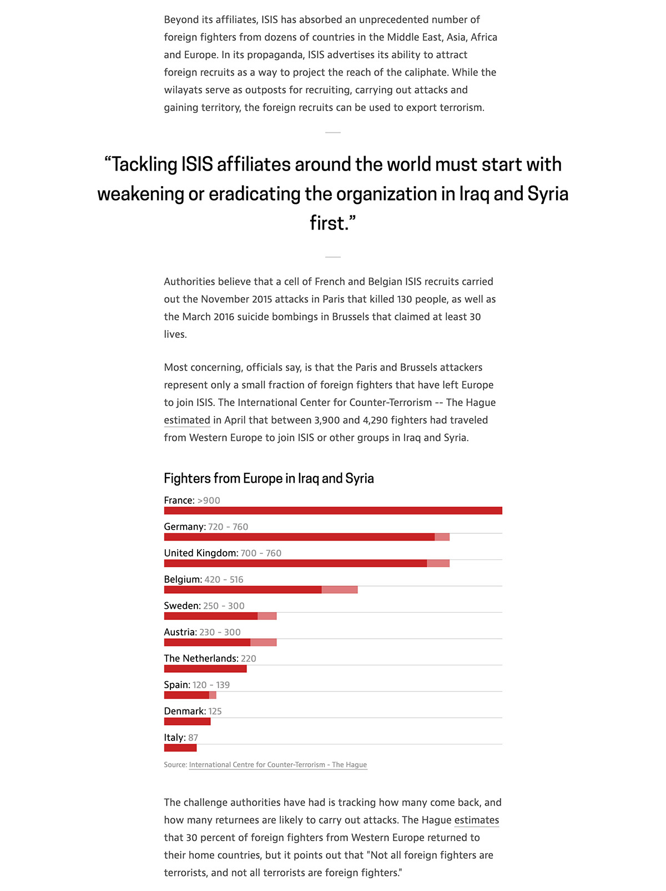

[Where the Black FLag of ISIS Flies](http://apps.frontline.org/isis-affiliates/) is a text story that explains the various groups around the world that are affiliated with ISIS. These are Islamic extremist groups that have pledged allegiance to ISIS and been recognized by them. The goal of the story was to show that even though ISIS is losing ground in Iraq and Syria they have the ability to spread to other countries through these affiliated groups. I worked on the design and HTML/CSS. This was our first custom long-form story template and it became the basis for similar stories moving forward. 

	

		

			
		

		

			
		

	

Embedded maps show the groups' locations and a chart shows the number of fighters from European countries in Iraq and Syria.