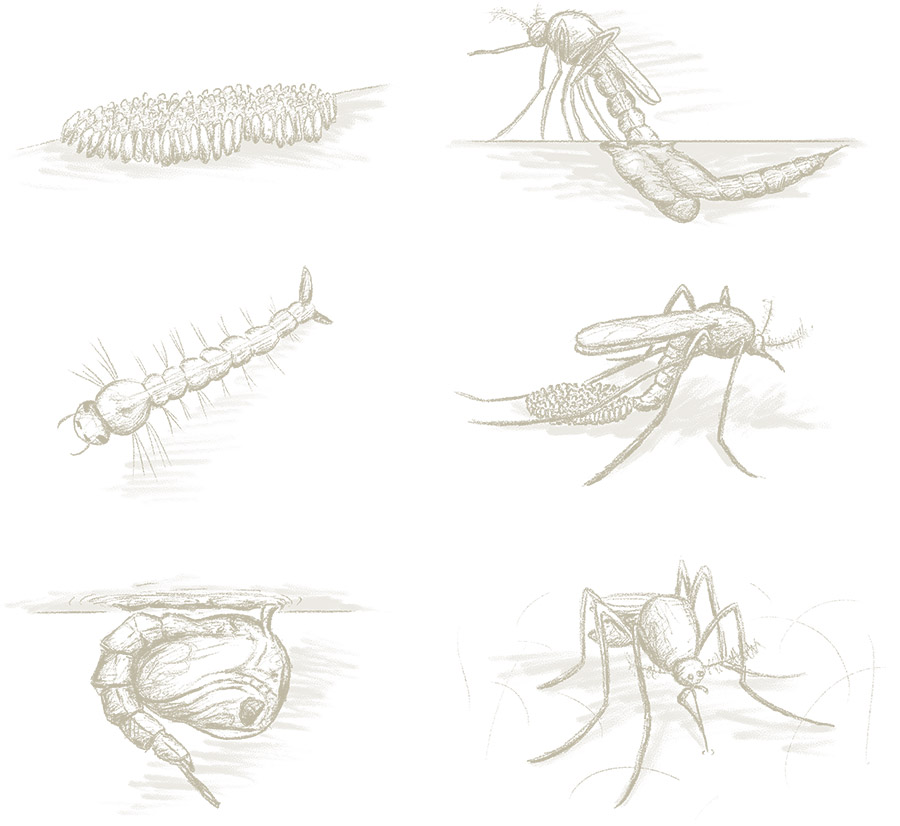
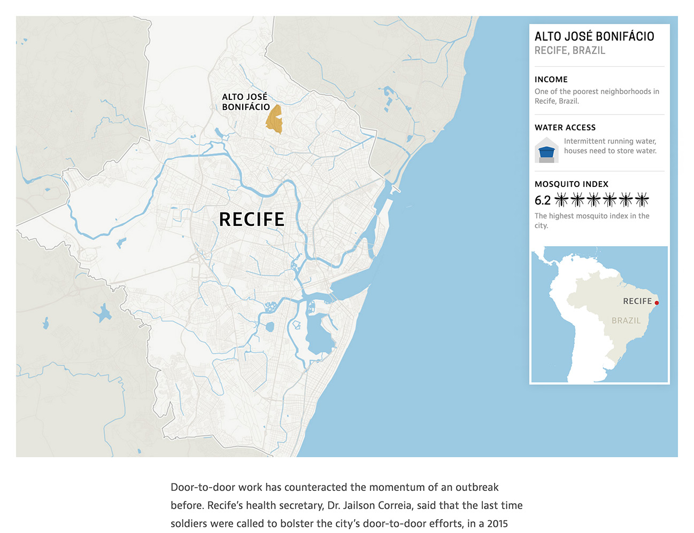
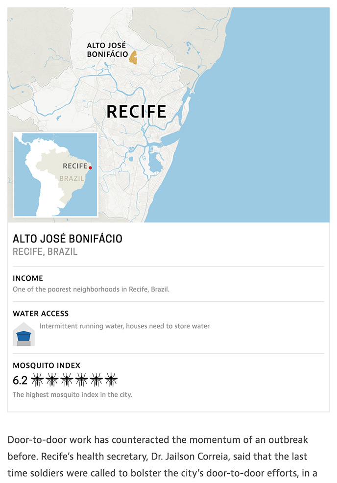
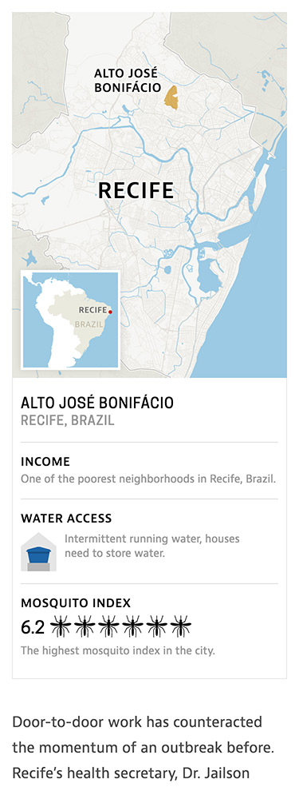

Ex natum intellegam ius, mazim complectitur his cu. His an impetus euripidis, facer nominavi mediocritatem vis an. Vitae accumsan ea est, in [postea conclusionemque](https://help.ghost.org/hc/en-us/articles/224410728-Markdown-Guide) duo. Corpora partiendo moderatius his ad, an discere gubergren his. Paulo diceret referrentur no per, mei ex veniam laboramus, no elit maiestatis sea.

	

Unum laboramus urbanitas sit in, ius copiosae persecuti adolescens ex, his suscipit vivendum cu. An nec laoreet electram evertitur, vel primis maiestatis eu. Ex sint oportere vulputate mea. Eu justo consectetuer his, tamquam iuvaret epicurei nam ut. Democritum sadipscing id eam. Bonorum definiebas dissentias ad qui, vel no movet offendit, an eos placerat recusabo mandamus.

	

		

			
		

		

			
		

		

			
		

	

