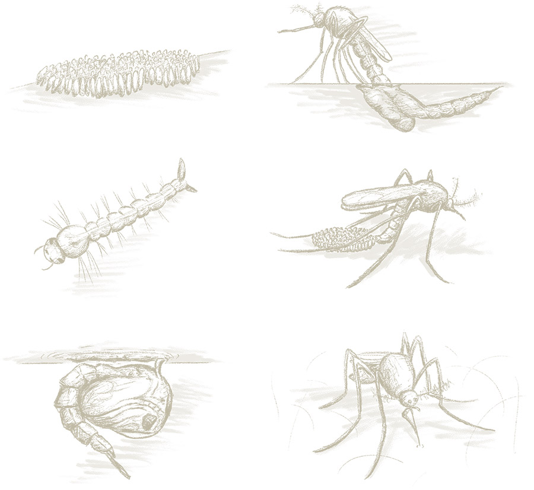
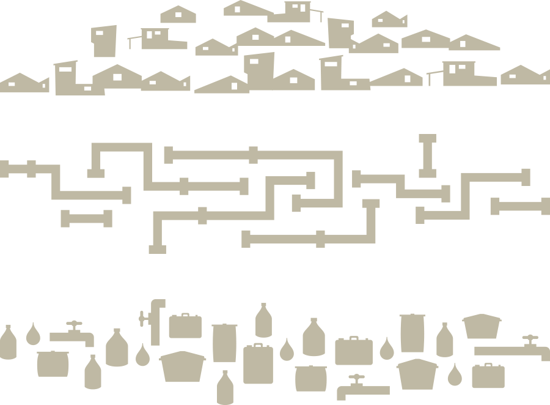
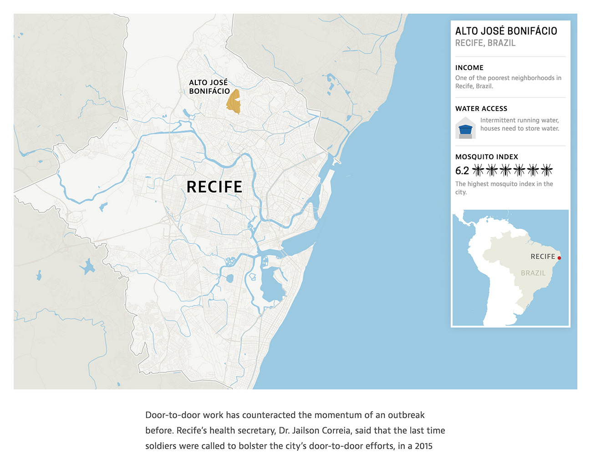
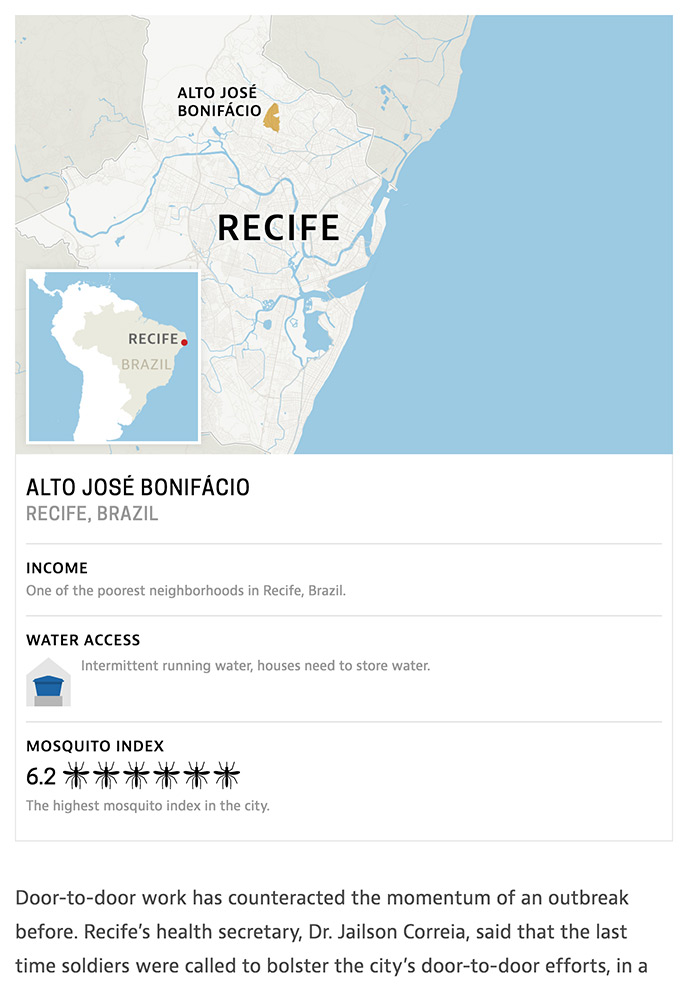
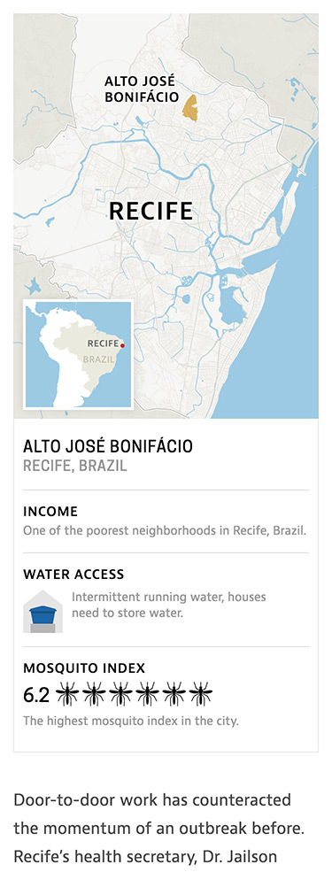
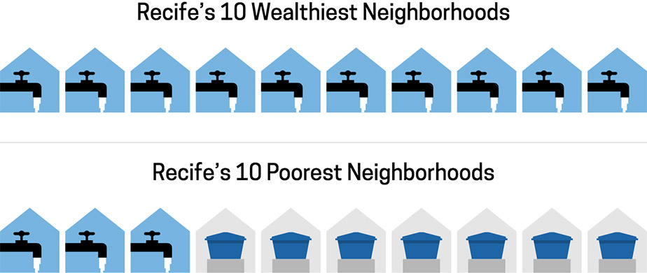

[Zika Uncontained](http://apps.frontline.org/zika-water/) is a long form text article with integrated video and graphics—its goal is to show how infrastructure issues in Brazil have worsened the spread of Zika. The project was spearheaded by reporter [Katie Worth](https://twitter.com/katieworth) and video producer [Michelle Mizner](https://twitter.com/michellemizner), I worked with them to nail down the user experience and execute the visual design and graphics.

## The Illustrations
Each chapter beginning is marked with an illustration of the mosquito life cycle. The tone of the illustrations had to match the seriousness of the piece. I chose to do realistic mosquito illustrations rendered in hand-drawn pencil lines.

	

I tried a couple of different directions before arriving at this solution. In an earlier iteration I looked at more abstract, iconic patterns inspired by Recife, Brazil, the city that the article was focused on. But these proved to feel too playful and didn’t match the seriousness of the story.

	

## The Map
The article focused on one neighborhood in Recife, Brazil where the mosquito problem was at its worst. We wanted to show a map of the city and highlight the neighborhood to orient the user and show the relationship of this one small neighborhood to the larger city.

	

		

			
		

		

			
		

		

			
		

	

The key infrastructure problem in the story is water access. And the map illustrates the irony of a city surrounded by ocean and rivers, but a city that struggles to deliver constant running water to its residents—particularly its poor. The information card introduces data that is covered in greater detail later. The map and data graphics needed to treated as self-contained, responsive layouts with customized type size optimization and unique breakpoints. 

## The Charts
Our reporter collected powerful data about water, income and mosquitos for the city of Recife. This was the early driver behind the story. We needed visuals that could communicate a connection between income, water access and a higher mosquito population. After many iterations we chose a direction that focused on the 10 wealthiest and 10 poorest neighborhoods. The water graphics are very stripped down, they show how many neighborhoods have constant running water and how many do not. And the mosquito graphics illustrate that the poorer neighborhoods have higher mosquito populations.

		

			
		

		

			
		

I looked at many directions for visualizing this data. Our final solutions were the clearest and most compelling, and they represented the data in the most fair and accurate way. Here are some earlier design options for the mosquito and water graphics.

	

